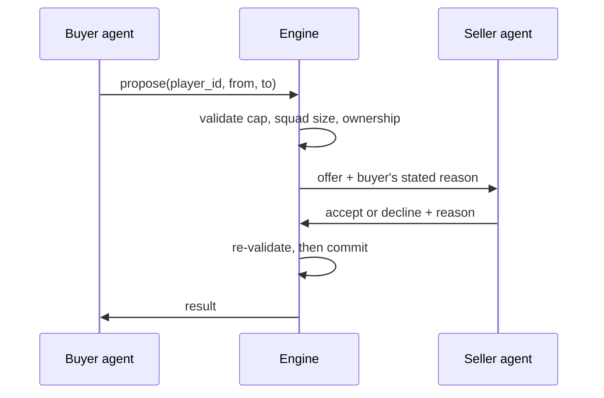

# Club Trading Sim — Engineering Brief

_As of 2026-09-18_

## What we're building

Ten LLM agents, each acting as the owner of a Premier League club, trade players with each other under a salary cap until no one wants to trade any more. Three clubs start over the cap and must sell. The demo is the negotiation, not the football.

The split of work:

- **Taylor** — the agent loop, the trade protocol, and the rules engine that validates every proposed move.
- **Austin and Drew** — the UI that makes an agent's reasoning and the cap pressure legible to someone watching.

A demo run is successful when a viewer can watch it end to end and answer three questions without help: who is under pressure and why, what deal was just proposed, and whether the squads got better. If a viewer has to ask us what happened, the run failed regardless of what the agents did.

The simulation is closed. No money enters or leaves, no players are created or destroyed, and no club outside the ten participates.

## The economic model

These rules are the whole game. Taylor enforces them server-side; Austin and Drew must display them identically, because a UI that shows a different number from the one the engine used will read as a bug in the agent.

**There is no transfer fee and no cash.** A trade moves a player from one club to another. The selling club stops paying that salary, the buying club starts paying it. Nothing else changes hands. Do not build a wallet, a bank balance, or a transfer budget — there is nothing for them to hold.

**Straight moves only, never swaps.** One player, one direction, per trade. If two clubs want to exchange players, that is two separate trades, each validated on its own. This matters for the UI: a trade card shows one player and an arrow, never two.

**The cap is a hard ceiling on total wages.** A club's wage bill is the sum of `annual_salary_gbp` across its current roster. A buy that would push the bill above `salary_cap_gbp` is rejected. Selling is always legal.

**Squad size is capped at 20** for every club, so a rich club cannot simply hoard talent. There is no minimum squad size and no minimum per position — an agent is allowed to sell its last goalkeeper, and we are curious whether one does.

**Each agent is maximizing the sum of `value_rating` across its own roster**, subject to those two constraints. That single objective is what makes selling rational: dropping an overpaid rating-4 and signing an underpaid rating-7 at the same wage is a clean gain of three points.

A trade is valid only when all four hold:

1. The buyer's wage bill after the move is at or below its cap.
2. The buyer's squad size after the move is at or below 20.
3. The player is currently on the seller's roster.
4. Buyer and seller are different clubs.

Note that a club starting over its cap is not required to reach compliance before it may buy — but every buy is checked against the cap, so in practice it cannot buy until it has sold. Do not add a separate "must be compliant first" rule; the cap check already produces that behaviour.

## The datasets

Two CSVs, 150 players across 10 clubs, joined on `club_id`. There is no roster list column — a club's squad is every player row carrying its id.

`players.csv`

| Column | Type | Notes |
| --- | --- | --- |
| `player_id` | string | `P001` to `P150`, stable, the only safe key |
| `name` | string | Real 2025-26 Premier League players |
| `club_id` | string | Foreign key to `clubs.csv`; never blank, there are no free agents |
| `position` | string | One of Goalie, Defender, Midfield, Forward |
| `annual_salary_gbp` | integer | Raw pounds per year, e.g. `27300000` |
| `value_rating` | integer | 1 to 10, whole numbers only |

`clubs.csv`

| Column | Type | Notes |
| --- | --- | --- |
| `club_id` | string | Three-letter code, e.g. `MUN` |
| `club_name` | string | Display name |
| `salary_cap_gbp` | integer | Hard ceiling on total wages |
| `max_squad_size` | integer | 20 for every club |

Wage bill and headroom are deliberately **not** stored. Both are derived from the player rows, so they cannot drift out of sync with reality after a trade. Compute them; never cache them in the club record.

The starting position:

| Club | Squad | Wage bill | Cap | Headroom |
| --- | --- | --- | --- | --- |
| Manchester City | 18 | £160.7m | £180.0m | +£19.3m |
| Liverpool | 17 | £139.5m | £156.2m | +£16.7m |
| Arsenal | 17 | £137.4m | £153.9m | +£16.5m |
| Newcastle United | 14 | £70.7m | £79.2m | +£8.5m |
| Aston Villa | 14 | £64.5m | £72.2m | +£7.7m |
| Brighton & Hove Albion | 12 | £33.4m | £37.4m | +£4.0m |
| Brentford | 10 | £21.4m | £24.0m | +£2.6m |
| Tottenham Hotspur | 15 | £83.3m | £76.6m | −£6.7m |
| Chelsea | 17 | £127.4m | £117.2m | −£10.2m |
| Manchester United | 16 | £133.9m | £123.2m | −£10.7m |

Three things about this data drive agent behaviour, and the UI should make all three visible.

**Price barely tracks quality in the middle.** Correlation between rating and salary is 0.48. Ratings 4 through 7 cover 119 of the 150 players and all four bands average between £4.9m and £5.5m — a rating-7 costs the same as a rating-4. Price only starts discriminating at rating 8. That flat band is the entire arbitrage.

**Supply and demand are mismatched.** The three forced sellers must shed £27.6m combined. Buyers hold £75.3m of headroom, but £19.3m of it sits at City, who need very little, and Brentford and Brighton have £6.6m between them — roughly one mid-tier player each.

**Quality is concentrated where there is no pressure to sell.** Only 31 players rate 8 or above, and 22 of them are at City, Arsenal and Liverpool, all comfortably under cap. Expect agents to compete over a thin tier of genuinely available talent.

One caution for anyone tempted to sanity-check the data against reality: the squads reflect roughly mid-2026 knowledge and will have drifted, and the ratings are invented. They are simulation inputs, not scouting. Do not build any UI copy that presents a rating as a real assessment of a real footballer.

## Backend and agents — Taylor

One agent per club, ten in total, each prompted as that club's owner. The engine owns the roster state and the rules; the agent only ever proposes.

The trade lifecycle:

Re-validating after the seller accepts is not redundant. Two buyers can be mid-negotiation for the same player, and the first commit invalidates the second. Never trust a validation taken before the seller replied.

**What an agent sees.** Its own roster in full, every other club's roster in full, and every club's cap and squad size. There is no hidden information in this sim — the interesting behaviour comes from the mispricing, not from secrecy. Do not add fog of war.

**What an agent may do on its turn.** Propose one trade, respond to a pending offer, or pass. Every action carries a one-sentence reason in natural language; the UI depends on it, so make it a required field rather than an optional one the model may skip.

**Turn order.** Round-robin, with the three over-cap clubs going first in round one so the demo opens with visible pressure rather than a quiet round of passes.

**Validate in code, never in the prompt.** Agents will propose illegal trades. Reject them with a structured error naming which of the four conditions failed and by how much — "£3.2m over cap" rather than "invalid". Feed that back to the agent so it can retry, and surface it to the UI, because a rejected proposal is one of the more interesting things a viewer can watch.

**Termination.** The run ends when every agent passes in a full round, or at a round cap we set for the demo. Both endings must be distinguishable in the output — the first means the market cleared, the second means we ran out of patience, and they say very different things about the model.

**Emit an event log, not just final state.** Every proposal, rejection, acceptance and pass, in order, with the agent's stated reason attached. The UI is built on this stream and so is any post-run analysis. Include each club's wage bill and squad rating total after every committed trade so nothing downstream has to replay the log to plot a line.

One trap worth naming: nothing in the rules stops two clubs trading a player back and forth forever if both agents believe they gained. Add loop detection on repeated player-club pairs before the demo, or a run will eventually stall in front of an audience.

## UI — Austin and Drew

The cap is the main character. Every screen should answer "who is squeezed and by how much" before it answers anything else. A club that is £10.7m over is the reason the next ten minutes are interesting.

**League view.** Ten clubs, each showing wage bill against cap as a filled bar. Over-cap clubs need to be unmistakable at a glance and from across a room — this is the demo's opening shot. Show squad size against the limit of 20 as a secondary figure; a club at 20 cannot buy no matter how much headroom it has, and that will otherwise look like a broken agent.

**Club view.** The roster, sorted by salary descending by default, with rating beside it. Salary and rating together are what expose the mispricing, so never show one without the other. Casemiro at £18.2m for a rating of 4 should look wrong on sight.

**Trade feed.** Chronological, one entry per event, and it must include rejections and passes rather than only successful trades. Each entry shows the player, the direction, both clubs' wage bills after the move, and the agent's stated reason verbatim. The reason is the product. Do not summarize it, truncate it to a chip, or hide it behind a hover.

**Make the constraint visible at the moment it binds.** When a proposal is rejected for being over cap, show the gap — "£3.2m over" — not a generic failure. Watching an agent try, get refused, and adjust is the clearest evidence that the thing is actually reasoning.

A few specifics that follow from the mechanics:

- Never render a price, fee, transfer budget, or currency exchange anywhere. There is no money in this sim, and a fee field would make reviewers think we cut a feature.
- A trade card shows one player and one arrow. Never build a two-sided swap layout; it cannot happen.
- Do not display headroom as a stored number attached to a club. Derive it from the roster on render, same as the backend, or the two will disagree after a trade and the UI will be the one that looks wrong.
- Ratings are whole numbers 1 to 10, nine is rare and there is exactly one ten. A 10-stop scale with one player at the top is a legitimate design problem — solve it deliberately rather than letting Haaland break the axis.

Pace matters for a live demo. Agent turns take seconds, so the feed will either crawl or flood depending on how you batch it. Build a deliberate playback speed with a pause, rather than rendering events the instant they arrive.

## Open decisions and scope

Deliberately out of scope for the demo: transfer fees, contracts and expiry, player age, form or injuries, squad legality rules, youth or reserve squads, and any notion of matches being played. Nobody wins a league here. If one of these turns out to be necessary, raise it rather than adding it quietly — every one of them changes what the agents optimize for.

Still open:

- **Round cap for the demo.** Needs to be short enough to watch and long enough to clear the £27.6m of forced sales. Suggest instrumenting a few dry runs before fixing a number.
- **Whether a seller may refuse indefinitely.** Nothing currently compels an over-cap club to accept any offer, so a stubborn agent can stall the whole run. We may need a rule that compliance is mandatory within N rounds.
- **Model choice and cost per run.** Ten agents times N rounds adds up quickly; worth measuring early.
- **What happens if an agent sells its last goalkeeper.** Legal under the current rules. It is either a great demo moment or an embarrassing one, and we should decide which before an audience sees it.

The single biggest risk to the demo is that the market clears in three rounds and then everyone passes. The forced sellers dump their worst contracts, the buyers with headroom absorb them, and it is over before it is interesting. If dry runs show that, the fix is to tighten caps rather than to add mechanics.
